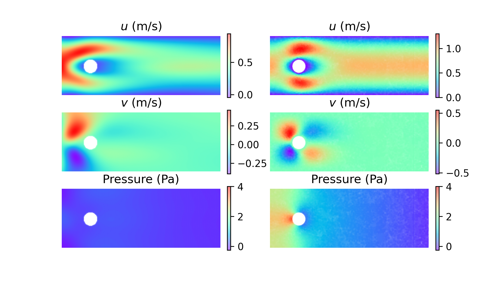
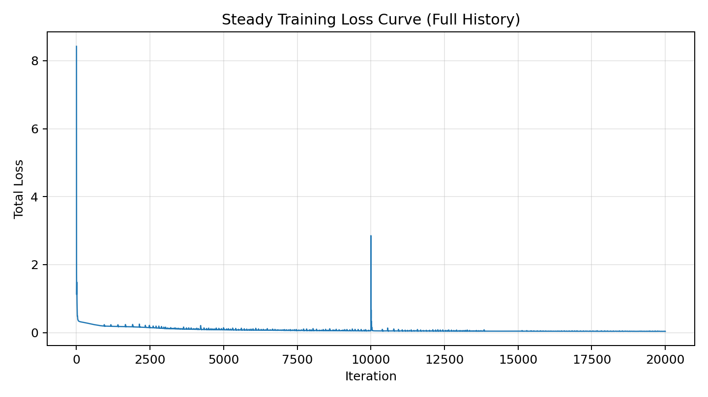

# PINN Laminar Flow

PyTorch implementation of physics-informed neural networks (PINNs) for incompressible laminar flow around a cylinder. The project includes steady and transient training flows, checkpoint/resume support, and saved experiment artifacts.

## Reference

This repository follows the mixed-form PINN setup from:

[Chengping Rao, Hao Sun and Yang Liu. Physics-informed deep learning for incompressible laminar flows.](https://arxiv.org/abs/2002.10558)

## Repository Layout

- `src/pinn_laminar_flow/`
  - PyTorch source code for steady and transient PINN models.
- `scripts/`
  - User-facing training and plotting entrypoints.
- `data/reference/`
  - Reference CFD data used for steady-flow comparison.
- `results/`
  - Checkpoints, figures, logs, and archived outputs from experiments.

## Setup

```bash
pip install -r requirements.txt
```

Device selection is supported with `--device {auto,cpu,cuda,mps}`. Use `--device mps` on Apple Silicon, `--device cuda` on NVIDIA GPUs, and `--device cpu` for CPU-only runs.

## Training

Run steady training:

```bash
python3 scripts/train_steady.py --device mps
```

Run transient training:

```bash
python3 scripts/train_unsteady.py --device mps
```

Resume steady training:

```bash
python3 scripts/train_steady.py \
  --device mps \
  --adam-iters 30000 \
  --load-checkpoint results/steady/checkpoints/steady_new.pt \
  --resume \
  --save-every 200 \
  --save-best \
  --checkpoint results/steady/checkpoints/steady_new.pt \
  --best-checkpoint results/steady/checkpoints/steady_new_best.pt \
  --loss-history results/steady/logs/steady_new_loss.pkl \
  --output-figure results/steady/figures/steady_new_uvp.png
```

Resume transient training:

```bash
python3 scripts/train_unsteady.py \
  --device mps \
  --adam-iters 10000 \
  --load-checkpoint results/unsteady/checkpoints/unsteady_latest.pt \
  --resume \
  --save-every 200 \
  --save-best
```

## Checkpoints

Both training flows save PyTorch `.pt` checkpoints with:

- model state
- optimizer state
- scheduler state
- loss history
- resume metadata (`iteration`, `best_loss`, `stale_steps`)

Useful flags:

- `--resume` continues from the checkpoint iteration.
- `--save-every N` writes a checkpoint every `N` Adam iterations.
- `--save-best` writes the best model by total loss.

## Plotting

Plot steady total loss from a checkpoint:

```bash
python3 scripts/plot_steady_loss.py \
  --input results/steady/checkpoints/steady_new.pt \
  --output results/steady/figures/steady_loss_curve.png
```

## Results

Steady artifacts:

- `results/steady/checkpoints/`
- `results/steady/figures/`
- `results/steady/logs/`

Transient artifacts:

- `results/unsteady/checkpoints/`
- `results/unsteady/figures/`
- `results/unsteady/logs/`

Representative steady outputs:




