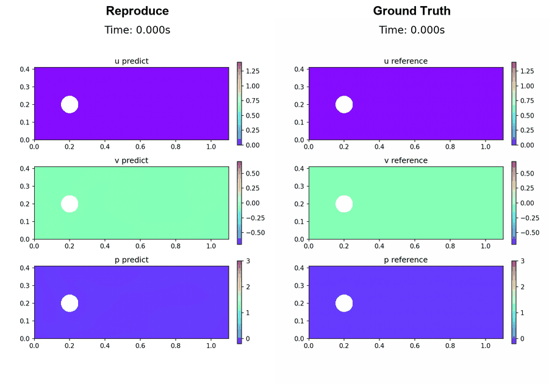

# ECE228 PINN

Tracked PyTorch PINN code, reference data, experiment scripts, reports, and archived results for incompressible laminar flow around a cylinder.



*Mixed-variable PINN reproduction compared against the Chorin projection reference CFD (`Re=10` cylinder flow, `t ∈ [0, 0.5]`s).*

## Setup

```bash
pip install -r requirements.txt
```

Or use the tracked setup script:

```bash
bash scripts/setup_env.sh
```

Use `--device auto`, `--device cpu`, `--device cuda`, or `--device mps` on scripts that forward device selection to Python. Training is GPU-intensive; a CUDA (or Apple MPS) device is strongly recommended.

## Reproducing the Report Results

All experiments are at `Re=10` (`mu=0.005`, `tmax=0.5`s, pulsatile inlet `period=1.0`s) and are scored against the Chorin projection reference `data/reference/unsteady_reference.mat`. The shared network is a 7×50 `tanh` MLP (Xavier-normal init) over `100k` Latin-hypercube collocation points (+`15k` wake / `3k`+`3k` wall refinement). Metrics are reported as post-initial-transient mean relative L2 over snapshots with `t ≥ 0.1`s.

Each track below trains, then benchmarks. The expected mean L2 (`u/v/p`, %) is the value reported in the paper; it is a sanity target, not a guarantee (seed / hardware differences apply).

### 1. `reproduce` — SciPy L-BFGS-B baseline

Paper-faithful strict reproduction (TF-style init, Adam 5k → SciPy L-BFGS-B). Maps to the **reproduce** row of Tables 1 and 3 (≈ `5.30 / 19.86 / 10.79`).

```bash
python3 src/unsteady_strict_reproduce.py \
    --exp-name strict_reproduce_scipy \
    --lbfgs-backend scipy \
    --save-best --device cuda

bash scripts/bench_unsteady.sh --exp-name strict_reproduce_scipy --device cuda
```

Outputs land in `results/phase1_reproduction/strict_reproduce_scipy/`.

### 2. `gpu-resident` — GPU-resident `torch.optim.LBFGS`

L-BFGS loop kept entirely on the GPU. Maps to the **GPU-resident** row of Tables 1 and 3 (≈ `5.94 / 22.23 / 10.31`).

```bash
bash scripts/train_unsteady.sh --exp-name vanilla_pytorch --device cuda
bash scripts/bench_unsteady.sh --exp-name vanilla_pytorch --device cuda
```

Outputs land in `results/phase1_reproduction/vanilla_pytorch/`.

The controlled backend benchmark (Table 2, `1.23×` speedup) toggles only the optimizer backend on the *same* code via the `--lbfgs-backend {scipy,torch}` flag of `src/unsteady_strict_reproduce.py`.

### 3. `causal` — causality-weighted Adam pretraining (all ε)

Adam pretraining with temporal-causality weighting (`M=32` bins, `lr=1e-3`), then an L-BFGS polish. `--causal-lbfgs frozen` keeps the causal weights during L-BFGS; `--causal-lbfgs uniform` reverts to the unweighted physical loss. Maps to the causal block of Table 3 and Figures 1/3. Best config: `ε=30, uniform` (≈ `4.64 / 18.60 / 8.89`).

```bash
# Frozen-weight L-BFGS polish (script default) for the full epsilon sweep
for EPS in 10 30 50 100; do
  bash scripts/train_causal.sh --causal-eps $EPS --adam-iters 20000 \
      --exp-name causal_eps${EPS} --device cuda
done

# Unweighted ("uniform") L-BFGS polish for the reported configs
for EPS in 30 50; do
  bash scripts/train_causal.sh --causal-eps $EPS --adam-iters 20000 --causal-lbfgs uniform \
      --exp-name causal_eps${EPS}_uniform --device cuda
done

# Benchmark a causal run (these write to results/checkpoints/<exp>/ and results/logs/<exp>/)
python3 src/bench_unsteady.py --exp-name causal_eps30_uniform \
    --checkpoint results/checkpoints/causal_eps30_uniform/latest_lbfgs.pt \
    --reference data/reference/unsteady_reference.mat \
    --tmax 0.5 --t-developed 0.1
```

The paper's `ε=30/50` figures used `--adam-iters 20000` and resumed the L-BFGS polish from the Adam-best checkpoint (see the `causal_eps*_adam20k` / `causal_eps*_uniform_from_adambest` logs).

### 4. `4a` — loss-balancing (Phase 4A, negative result)

Pluggable loss balancers compared against the fixed-β baseline. Reported in §4.3 as a **negative result**: no balancer improved field L2, and some collapsed toward a trivial near-zero-flow solution.

```bash
bash scripts/train_balanced.sh --balancer none             --exp-name none             --device cuda
bash scripts/train_balanced.sh --balancer grad_norm        --exp-name grad_norm        --device cuda
bash scripts/train_balanced.sh --balancer strict_grad_norm --exp-name strict_grad_norm --device cuda

bash scripts/bench_balanced.sh --exp-name grad_norm --device cuda
```

Outputs land in `results/phase4a_loss_balancing/<exp_name>/`.

## Tracked Entry Points

### Training

- `scripts/setup_env.sh`
  - Installs tracked Python dependencies and creates the `pyDOE` shim expected by the code.

- `scripts/train_unsteady.sh`
  - Re=10 vanilla baseline training.
  - Writes to `results/phase1_reproduction/<exp_name>/`.

```bash
bash scripts/train_unsteady.sh --device cuda
```

- `scripts/resume_unsteady.sh`
  - Resumes the Re=10 vanilla baseline from `latest_lbfgs.pt`.

```bash
bash scripts/resume_unsteady.sh --device cuda
```

- `scripts/train_balanced.sh`
  - Re=10 loss-balancer training with `none`, `grad_norm`, or `strict_grad_norm`.
  - Writes to `results/phase4a_loss_balancing/<exp_name>/`.

```bash
bash scripts/train_balanced.sh --balancer strict_grad_norm --exp-name strict_grad_norm_test --device cuda
```

- `scripts/train_causal.sh`
  - Re=10 causality-weighted Adam pretraining + L-BFGS polish (`--causal-eps`, `--causal-lbfgs {frozen,uniform}`).
  - Writes to `results/checkpoints/<exp_name>/` and `results/logs/<exp_name>/`.

```bash
bash scripts/train_causal.sh --causal-eps 30 --causal-lbfgs uniform --device cuda
```

- `scripts/train_re100_vanilla.sh`
  - Re=100 stress-test baseline.
  - Writes to `results/phase3_re100_stress/<exp_name>/`.

```bash
bash scripts/train_re100_vanilla.sh --device cuda
```

### Evaluation

- `scripts/bench_unsteady.sh`
  - Evaluates a Re=10 checkpoint against `data/reference/unsteady_reference.mat`.

```bash
bash scripts/bench_unsteady.sh --device cuda
```

- `scripts/bench_balanced.sh`
  - Evaluates a Phase 4A loss-balancer run against the Re=10 reference.

```bash
bash scripts/bench_balanced.sh --exp-name strict_grad_norm_test --device cuda
```

- `scripts/bench_re100.sh`
  - Evaluates a Re=100 checkpoint against `data/reference/unsteady_reference_re100_t2.mat`.

```bash
bash scripts/bench_re100.sh --device cuda
```

## Tracked Source Files

- `src/unsteady.py`
  - Main Re=10/Re=100 transient mixed-form PINN trainer.
- `src/unsteady_strict_reproduce.py`
  - Strict reproduction trainer with SciPy-style reproduction choices.
- `src/unsteady_balanced.py`
  - Loss-balancer trainer using `src/loss_balancers.py`.
- `src/loss_balancers.py`
  - `NoneBalancer`, `GradNormBalancer`, and `StrictGradNormBalancer`.
- `src/bench_unsteady.py`
  - Shared benchmark harness for Re=10 and Re=100 checkpoints.

## Tracked Data

- `data/reference/unsteady_reference.mat`
  - Re=10 CFD reference data.
- `data/reference/unsteady_reference_re100_t2.mat`
  - Re=100 CFD reference data.
- `data/reference/figures/`
  - Tracked reference animations and frame exports.
- `data/reference/*.py`
  - Scripts used to generate reference datasets and figures.

See `data/reference/README.md` for dataset details.

## Tracked Results

Results are phase-scoped under `results/`:

- `results/phase1_reproduction/`
  - Vanilla and strict reproduction baselines.
- `results/phase3_re100_reference/`
  - Re=100 reference-generation logs.
- `results/phase4a_loss_balancing/`
  - Fixed-beta, GradNorm, strict GradNorm, and smoke-test artifacts.
- `results/reference/`
  - Copied papers, reference reports, and original-paper artifacts from `ref/`.

See `results/README.md` for the directory convention.

## Notes

- `docs/` is local-only working documentation and is not tracked in git.

- `ref/`, `remote_gpu_pull/`, `tmp/`, and other untracked local working directories are not part of this README.
- For new ad hoc experiments, prefer `results/experiments/<exp_name>/` unless the run belongs to a named phase.
