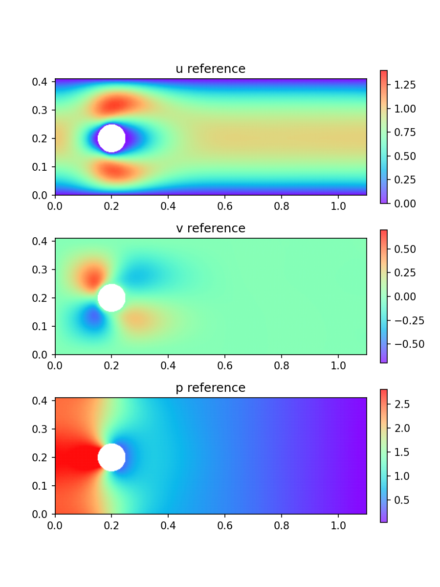
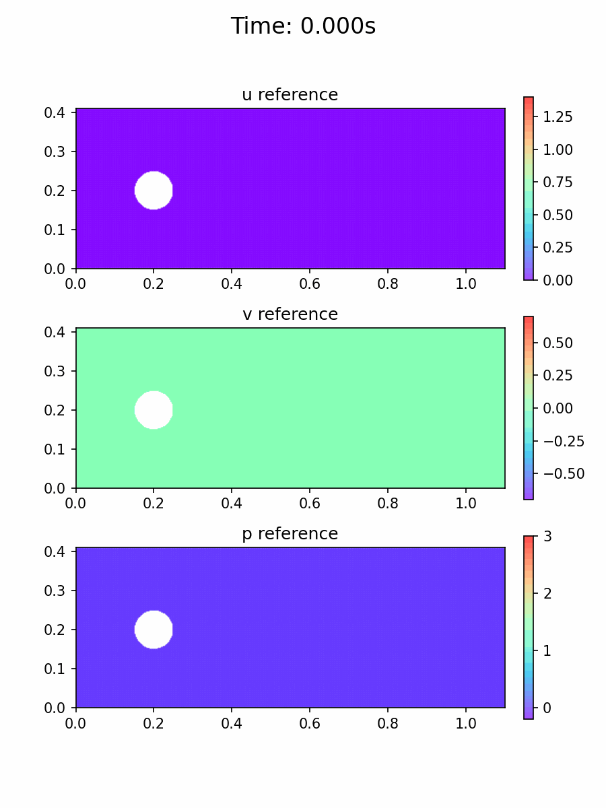

# Reference Datasets

Ground-truth CFD data used for PINN training and evaluation.

---

## Steady Reference — `steady_reference.mat`

Fluent-generated steady-state solution for 2D laminar flow past a cylinder.

| Parameter | Value |
|---|---|
| Domain | x ∈ [0, 1.1], y ∈ [0, 0.41] |
| Cylinder | centre (0.2, 0.2), r = 0.05 |
| μ | 0.001 |
| ρ | 1.0 |
| U_max | 1.0 |
| Re | ~20 |
| Points | 19,340 (non-uniform scattered mesh) |

**Variables:** `x` (1×Ns), `y` (1×Ns), `vx` (1×Ns), `vy` (1×Ns), `p` (1×Ns)

---

## Unsteady Reference — `unsteady_reference.mat`

Pure-Python 2D incompressible NS solver using Chorin fractional-step projection on a collocated Cartesian grid. Generated by [`gen_unsteady_reference.py`](gen_unsteady_reference.py).

| Parameter | Value |
|---|---|
| Domain | x ∈ [0, 1.1], y ∈ [0, 0.41] |
| Cylinder | centre (0.2, 0.2), r = 0.05 (IBM) |
| μ | 0.005 |
| ρ | 1.0 |
| U_max | 0.5 |
| Period | 1.0 s |
| Re | 10 |
| Grid | 220 × 82 (dx = dy = 0.005) |
| dt | 0.001 s |
| T_max | 0.5 s |
| Snapshots | 51 (t = 0, 0.01, …, 0.50 s) |
| Fluid points | 17,724 (cylinder cells excluded) |

**Variables:** `x` (Ns×1), `y` (Ns×1), `t` (Nt×1), `u` (Ns×Nt), `v` (Ns×Nt), `p` (Ns×Nt)

**Inlet BC:** u(0, y, t) = 4 U_max · y(H−y)/H² · (sin(2πt/T + 3π/2) + 1)

**Numerical scheme:**
- Forward-divergence / backward-gradient pair → exact discrete div(u) = 0
- Dirichlet φ = 0 at outlet only (cylinder cells treated as interior to avoid mass-sink artifacts)
- Neumann ∂φ/∂n = 0 at inlet, top, and bottom walls

> **Note on pressure:** The Chorin scheme accumulates pressure as p += φ each step. The absolute magnitude grows with time (O(1000 Pa) by t = 0.5 s) due to IBM boundary residuals. Spatial gradients are physically correct; use demeaned or per-frame normalised pressure for visualisation.

### Animation (51 frames, 120 ms/frame)

